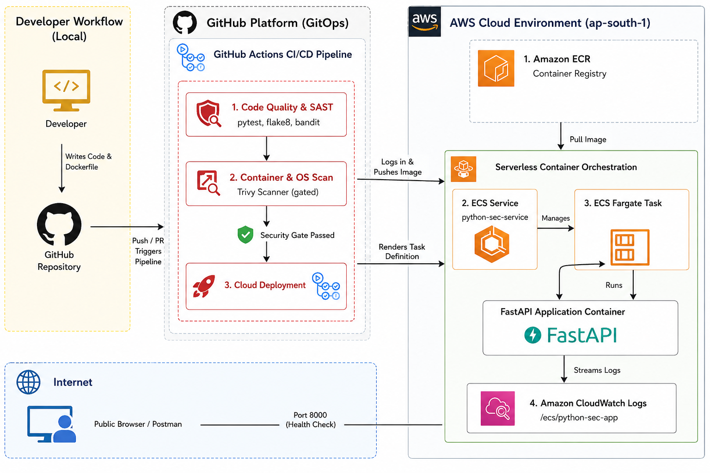
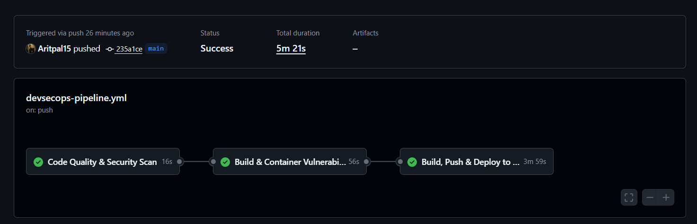
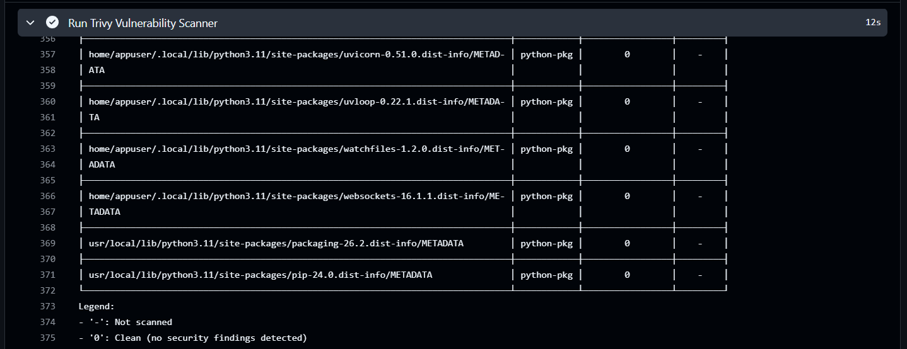
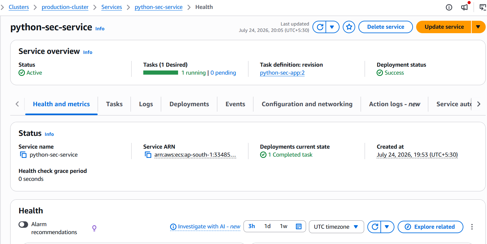
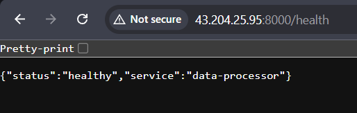

# 🛡️ DevSecOps Pipeline: Containerized Python Microservice on AWS ECS Fargate

An end-to-end production-grade **DevSecOps CI/CD pipeline** for a Python FastAPI microservice. This project demonstrates automated code quality testing, Static Application Security Testing (SAST), container image vulnerability scanning ("Shift Left" security), and serverless cloud deployment to **AWS ECR** and **AWS ECS Fargate**.

---

## 📐 Architecture & DevSecOps Workflow

The pipeline triggers automatically on every `git push` to the `main` branch and executes a sequential 3-stage security and deployment lifecycle:



### 🔄 Workflow Breakdown

**Stage 1: CI & SAST (Code Quality & Security)**
- **Pytest** — Runs automated unit tests to verify microservice logic.
- **Flake8** — Enforces Python PEP 8 style guidelines and code quality.
- **Bandit** — Performs Static Application Security Testing (SAST) to detect security flaws in Python code.

**Stage 2: Container Security Gate**
- **Multi-Stage Docker Build** — Constructs an optimized container image using a non-root security context (`appuser`).
- **Trivy Vulnerability Scan** — Scans the Docker image for OS and package vulnerabilities. Pipeline **blocks deployment** if `HIGH` or `CRITICAL` vulnerabilities are detected.

**Stage 3: Continuous Deployment (AWS Cloud)**
- **Amazon ECR** — Authenticates and pushes version-tagged container images.
- **AWS ECS Fargate** — Deploys and updates serverless tasks with zero downtime across AWS isolated VPC subnets.

---

## 🚀 Pipeline & Deployment Proofs

### 1. Automated GitHub Actions Pipeline
Every commit automatically runs through all quality checks, security scans, and cloud deployment steps:



---

### 2. Trivy Container Vulnerability Scan Results
Demonstrating "Shift Left" security enforcement with zero detected vulnerabilities:



---

### 3. AWS ECS Fargate Active Cluster & Service
Verifying active serverless container orchestration on AWS:



---

### 4. Live API Endpoint Health Check
Proof of live public deployment and healthy endpoint response:



---

## 🧰 Tech Stack & Tools

| Category | Tools |
|---|---|
| **Application** | Python 3.11, FastAPI, Uvicorn |
| **Containerization** | Docker (multi-stage build, non-root user execution) |
| **Security & SAST** | Bandit (code analysis), Trivy (container CVE scanner) |
| **CI/CD** | GitHub Actions |
| **Cloud Infrastructure** | AWS ECR, AWS ECS Fargate, AWS VPC, AWS CloudWatch |

---

## 🏃 Local Setup & Development

### 1. Clone the Repository

```bash
git clone https://github.com/Aritpal15/python-docker-sec-pipeline
cd python-docker-sec-pipeline
```

### 2. Set Up Virtual Environment & Run Locally

```bash
python -m venv venv

# On Windows PowerShell:
.\venv\Scripts\Activate.ps1

pip install -r requirements.txt
uvicorn app.main:app --reload --port 8000
```

Access the local health endpoint at `http://localhost:8000/health`.

---

## 🛡️ Security Features Implemented

- **Non-Root Execution** — Docker containers run as a restricted user (`appuser`) rather than `root` to prevent container breakout vulnerabilities.
- **Automated Security Gates** — Pipeline fails fast if Bandit or Trivy detects security vulnerabilities.
- **Serverless Compute** — Deployed on AWS ECS Fargate inside isolated subnets for maximum network security.